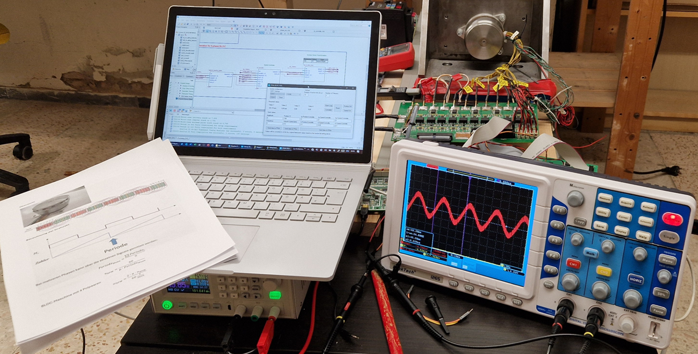
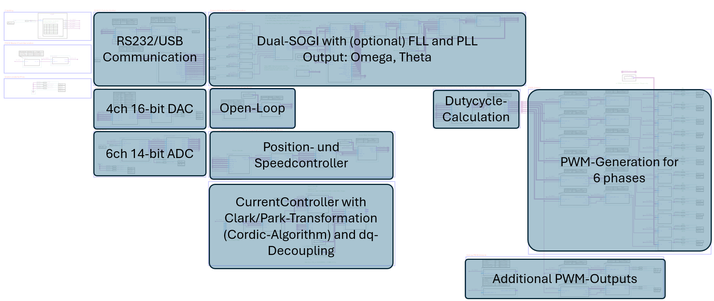
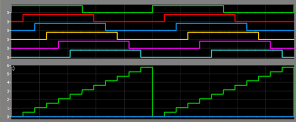
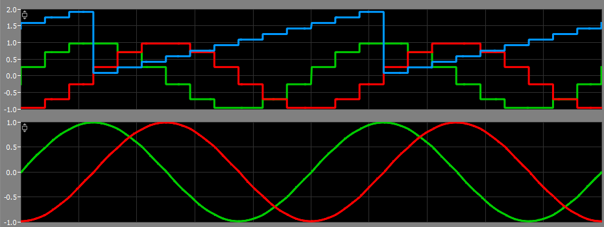
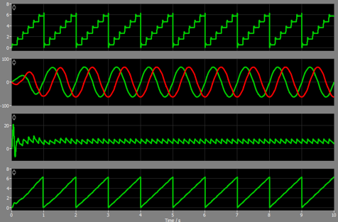
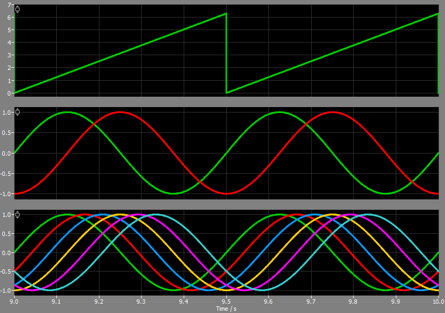

# FPGA_BLDC_FOC

## General information

This repository contains a field-oriented control (FOC) for a 6-phase BLDC-motor. It runs on an Altera Cyclone III FPGA (EP3C40F484C6) using Quartus 13.1. Newer versions of Quartus do not support the Cyclone III, but the VHDL-logic can be ported to newer models like the Cyclone 10LP without problems as it does not use any specific functions of the Cyclone III.

Here is an example of the constructed hardware:

## Overview of the FPGA-project

The FPGA contains a full-featured FOC including PLL, PWM, dq-transformation and more:

## Angle- and speed-detection of the motor / controller for motor-current

The FPGA contains some special algorithms for detecting the speed of the motor, as no special angle-position-measurement is used, but only some cheap hall-sensors. For this, the hall-signals are converted to a rough saw-tooth-signal:

Then this saw-tooth-signal (blue-signal) is converted into a rough alpha-/beta-signal (stair-stepped sine-waves). A Second-Order-Generalized-Integrator (SOGI) is then used to create phase-correct ideal sine-waves of the rough original signals:

Afterwards these two alpha-/beta-signals are fed into a PLL to calculate the current omega (hence speed) and a phase-locked saw-tooth-signal theta, directly locked to the rotor-position and that is resilient against disturbances:

Finally, this theta (the rotor-position) is used to feed a controller for the motor-current that calculates a new alpha/beta-signal, that can be used to calculate reference-signals for 6 PWM-generators:

